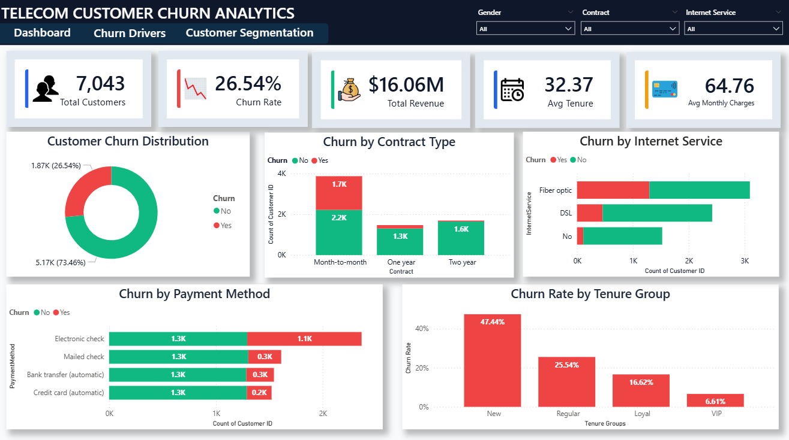
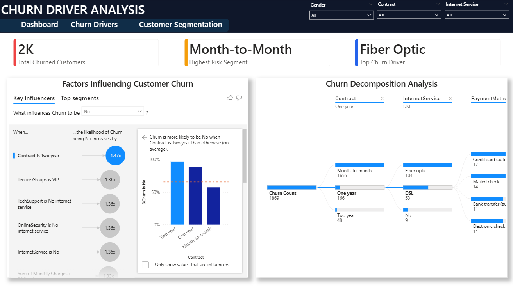
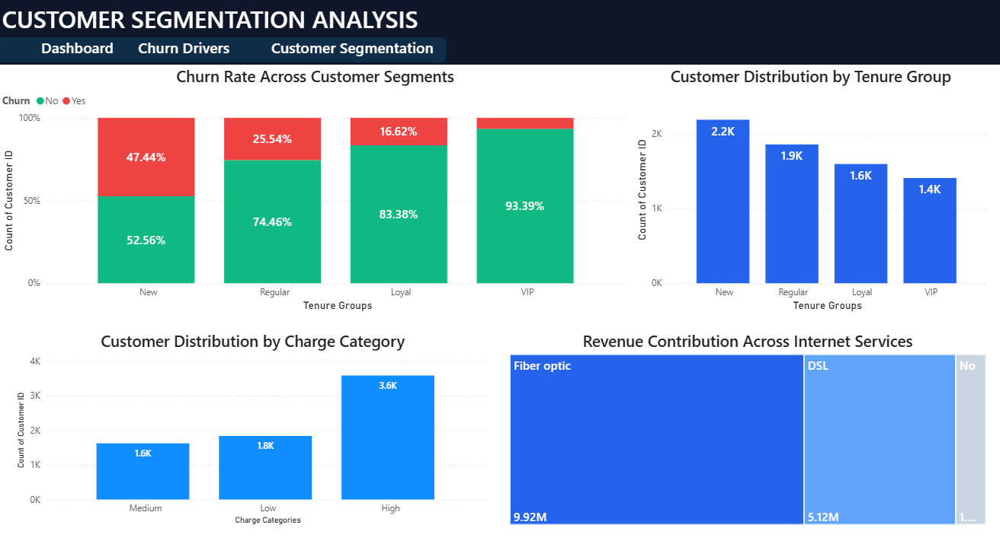

# 📊 Telecom Customer Churn Analysis Dashboard

## 🚀 Overview

This project focuses on analyzing customer churn behavior in the telecom industry using Power BI. The objective is to identify the key factors influencing customer attrition, uncover high-risk customer segments, and provide actionable insights to improve customer retention.

The dashboard analyzes over **7,000+ customer records** and presents findings through interactive visualizations, business intelligence reporting, and customer segmentation techniques.

---

## 🎯 Business Objectives

* Identify patterns and trends behind customer churn.
* Analyze the impact of contracts, payment methods, internet services, and tenure on churn behavior.
* Discover high-risk customer segments.
* Support data-driven customer retention strategies.
* Provide business stakeholders with actionable insights through interactive dashboards.

---

## 🛠️ Tools & Technologies

* 📊 Power BI
* 📈 DAX (Data Analysis Expressions)
* 📑 Microsoft Excel
* 📉 Data Visualization
* 📋 Business Intelligence
* 🎯 Customer Segmentation
* 📊 KPI Monitoring & Reporting

---

## 📂 Dashboard Pages

### 1️⃣ Executive Dashboard

Provides a high-level overview of business performance and churn metrics.

**Key Features**

* Total Customers
* Customer Churn Rate
* Total Revenue
* Average Customer Tenure
* Average Monthly Charges
* Churn Distribution Analysis
* Contract Type Analysis
* Internet Service Analysis
* Payment Method Analysis
* Tenure Group Analysis

---

### 2️⃣ Churn Driver Analysis

Identifies the primary factors contributing to customer churn.

**Key Features**

* Key Influencers Visual
* Decomposition Tree Analysis
* Churn Driver Investigation
* Customer Behavior Analysis

---

### 3️⃣ Customer Segmentation Analysis

Segments customers based on tenure, spending behavior, and service usage patterns.

**Key Features**

* Churn Rate Across Customer Segments
* Tenure Group Distribution
* Charge Category Analysis
* Revenue Contribution by Internet Service
* Customer Segment Insights

---

## 📸 Dashboard Preview

### Executive Dashboard



### Churn Driver Analysis



### Customer Segmentation Analysis



---

## 📊 Key Insights

✅ Customers with **Month-to-Month contracts** exhibit the highest churn.

✅ **Fiber Optic** users are more likely to churn compared to DSL customers.

✅ Customers using **Electronic Check** payment methods show the highest attrition.

✅ Customers with **low tenure (0–12 months)** represent the highest-risk segment.

✅ Long-term customers demonstrate significantly higher retention rates.

---

## 📁 Repository Structure

```text
Telecom-Customer-Churn-Analysis/
│
├── Dashboard/
│   └── Churn Analytics.pbix
│
├── Dataset/
│   └── Telco_Customer_Churn.csv
│
├── Images/
│   ├── executive_dashboard.png
│   ├── churn_drivers.png
│   └── customer_segmentation.png
│
├── README.md
├── LICENSE
└── .gitignore
```

---

## ▶️ How to Use

1. Clone this repository.
2. Open the `.pbix` file using Power BI Desktop.
3. Explore the interactive dashboard pages.
4. Apply filters and slicers to analyze customer behavior.
5. Review key insights and churn trends.

---

## 📌 Project Highlights

* Analyzed **7,000+ telecom customer records**
* Built a **multi-page interactive Power BI dashboard**
* Created advanced visualizations using **Key Influencers** and **Decomposition Tree**
* Performed customer segmentation, churn analysis, and revenue contribution analysis
* Generated actionable business insights for customer retention

---
